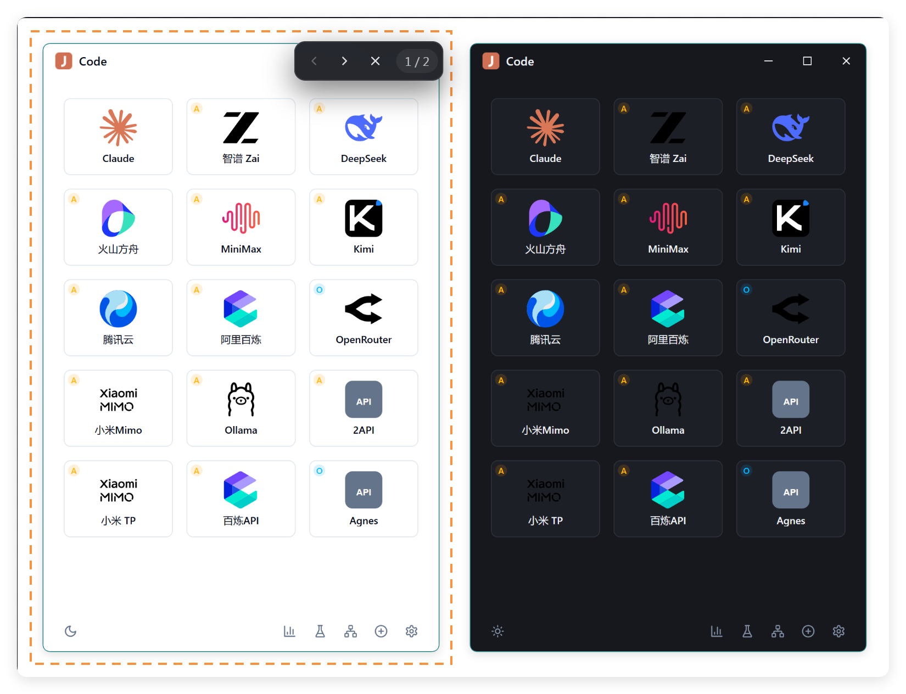

# JCode

一个 Claude Code 多平台启动器，支持平台管理、协议转换、批量测试、Token 统计。



## 功能

- **多平台启动**: 内置 Claude、阿里百炼、MiniMax、智谱、Kimi、火山方舟、腾讯混元、小米 Mimo、百度云、OpenRouter、DeepSeek、Ollama、OpenAI 兼容等预设，也支持自定义平台。
- **协议与模型管理**: 支持 Anthropic 原生端点直连，也支持 OpenAI 兼容端点经本地代理转换为 Claude Code 可用的 Anthropic Messages API。
- **一键启动 Claude Code**: 点击平台图标或拖拽文件夹即可启动，自动注入 API Key、Base URL、模型、配置目录、网络代理和权限模式。
- **独立配置目录**: 每个平台可使用独立 `CLAUDE_CONFIG_DIR`，自动初始化 onboarding 与 API Key 授权记录，避免不同平台会话互相污染。
- **平台编排**: 支持平台启用/隐藏、拖拽排序、默认工作目录、额外启动参数、模型标签管理和默认模型切换。
- **本地代理**: 可监听 `127.0.0.1`，按模型名映射转发到目标平台，适合第三方客户端固定模型名或需要协议适配的场景。
- **批量测试**: 选择多个平台并发运行同一提示词，实时查看输出、工具调用、耗时和 Token 用量，并保存测试结果。
- **Token 统计**: 解析各平台 Claude Code 会话记录，查看会话数、消息数、Token 消耗、活跃天数、连续使用天数、热力图和模型用量排行。
- **设置与迁移**: 支持全局权限模式、网络代理注入、平台配置导入导出、旧版系统 Keychain 密钥迁移到本地加密存储。
- **自动更新**: 支持启动后静默检查更新、后台下载、手动重启更新或收进托盘后自动安装。

## 技术栈

- **前端**: React + TypeScript + Tailwind CSS + Vite
- **后端**: Tauri 2 (Rust)
- **本地服务**: Axum + Reqwest（本地代理与协议适配）
- **存储**: tauri-plugin-store + 本地加密密钥存储（支持从旧版 OS Keychain 迁移）

## 开发

```bash
# 安装依赖
npm install

# 启动开发模式
npm run tauri dev

# 构建发布包
npm run tauri build
```

## 安全提示

- API Key 保存在本机用户配置目录的加密文件中，不应提交到版本库。
- 设置页的“导出配置”会包含明文 API Key，导出的 JSON 文件请自行妥善保管，不要公开分享。
- 本地代理只监听 `127.0.0.1`，用于把 Claude Code 请求转发到已配置的平台。

## 项目结构

```
jcode/
├── doc/                     # 截图与文档素材
├── public/platform-icons/   # 平台 SVG 图标
├── src/
│   ├── components/          # UI 组件
│   ├── lib/presets.ts       # 平台预设配置
│   ├── pages/               # 页面
│   ├── store/               # Zustand 状态管理
│   └── types/               # TypeScript 类型
├── src-tauri/
│   ├── src/commands/        # Rust 后端命令
│   └── capabilities/        # Tauri 权限配置
└── .github/workflows/       # 发布工作流
```
